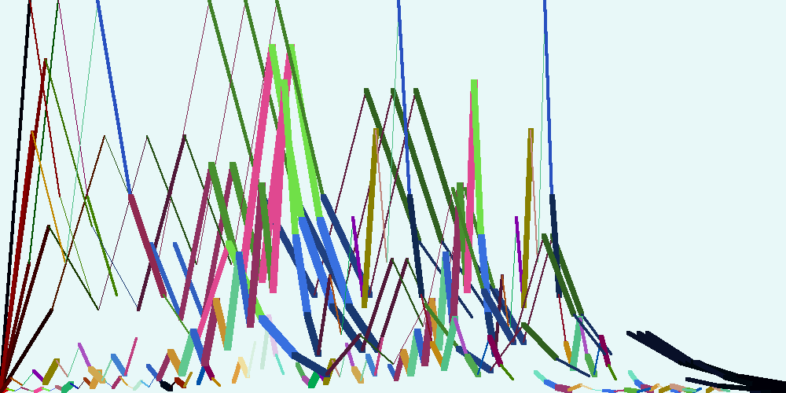

 
# Conjecture de Syracuse
_Auteur_ : silanoc
_Date création_ : 29 octobre 2021
_Dernière modification_ : 29 novembre 2021

page wikipédia expliquant mathématiquement la conjecture : https://fr.wikipedia.org/wiki/Conjecture_de_Syracuse

## Contenu :
### art&maths1.png 
image générée en 2014 avec squeak. Il s'agit des courbes de vol pour différents nombres. Chaque segment est dessiné avec une couleur différente. Elle a été pendant longtemps mon fond d'écran au travail.
### syracuse.py  
Code en python permettant d'afficher des courbes de vol pour un ou plusieurs nombres.
Auto-exercice pour améliorer mes compétences plus qu'autre choses. Première utilisation des doctests...
Il reste des erreurs à corriger, mais elles sont signalées et rendues invisibles par non-utilisation de ces parties.
